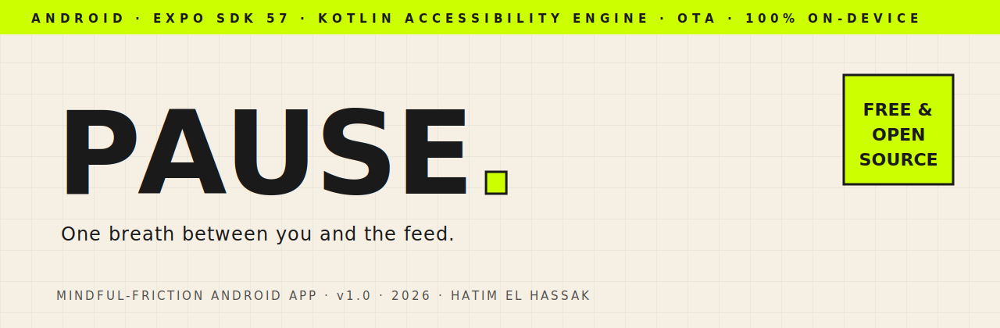

<div align="center">

<picture>
  <source media="(prefers-color-scheme: dark)" srcset="assets-readme/hero-banner-dark.svg">
  
</picture>

<br><br>

[](#-compatibility)
[](https://expo.dev)
[](https://reactnative.dev)
[](https://kotlinlang.org)
[](../../releases/latest)
[](LICENSE)

<br>

_A **<strong>self-installed focus app</strong>** for Android, inspired by **<strong>one sec</strong>** — it never blocks an app, it just makes the mindless open **<strong>inconvenient</strong>**. A short breathing screen before the apps you choose, **<strong>honest stats</strong>** on how you actually use them, optional notification muting, and quiet-hours. A native **<strong>Kotlin accessibility engine</strong>** under a React&nbsp;Native UI that updates **<strong>over-the-air</strong>**. Everything stays **<strong>100% on-device</strong>** — no accounts, no servers, nothing uploaded._

</div>

---

> [!NOTE]
> **Pause is for the person holding the phone.** It's a personal focus tool you install on your own device and control yourself — deliberately **not** a parental-control or remote-monitoring app. No hidden lock someone else holds, no covert tracking. That pattern is how coercive-control software works, and it doesn't help break a habit anyway. Pause helps *you* decide, with a calm nudge and honest numbers.

### `/// WHY`

Feeds and reels are engineered to be opened without thinking. Hard blockers lose — you just uninstall them. Pause borrows [one sec](https://one-sec.app)'s insight instead: don't forbid, add friction. A breath, a beat, a look at how long you've already spent today — then you're free to continue if you still want to. Over time the reflexive opens fade, and the ones that remain are the ones you actually meant.

### `/// INSTALL`

```
┌──────────────────────────────────────────────────────────────────────┐
│  1.  Download  pause.apk  from the Releases page                       │
│  2.  Open it on your Android phone → allow "install unknown apps"      │
│  3.  Grant permissions in the onboarding flow:                         │
│        • Accessibility  → so Pause knows which app opened (required)   │
│        • Usage access   → powers the time-per-app stats (recommended)  │
│        • Notifications  → for muting only (optional)                   │
│  4.  Pick the apps that pull you in → set your breath length → done    │
└──────────────────────────────────────────────────────────────────────┘
```

⬇️ **[Download the latest release →](../../releases/latest)**

### `/// FEATURES`

```
┌─ THE PAUSE   → full-screen breathing screen before any app you choose
├─ NEVER BLOCK → always "open anyway" after the breath — friction, not a wall
├─ REFLECT     → optional "why are you opening it?" prompt + wait timer (15s minimum)
├─ GUILT MODE  → the wait screen cycles your real numbers — today · yesterday · this week · opens
├─ STATS       → per-app time · opens · times you reached for it · times you backed out
├─ TRENDS      → 7-day chart of time on your watched apps — tap any day for the full breakdown
├─ QUIET HOURS → windows where every watched app pauses + notifications mute
├─ MUTE        → dismiss notifications from the apps you choose
└─ YOURS ALONE → on-device only · no accounts · no servers · nothing uploaded
```

### `/// HOW IT WORKS`

Pause is a hybrid, on purpose:

```
┌─ NATIVE ENGINE (Kotlin, modules/pause-native/)
│    AccessibilityService  → notices which app comes to the foreground
│    BreatheActivity       → the instant native breathing screen
│    NotificationListener  → mutes chosen apps / during quiet hours
│    UsageStats + SQLite   → time-per-app + on-device event log
│
└─ REACT NATIVE UI (TypeScript, src/)  ← updates OVER-THE-AIR
     onboarding · dashboard · stats · app picker · per-app config · settings
```

The breathing screen is native so it appears **instantly** (a JS screen would cold-start too slowly and let the app flash through). Everything else — every screen, all copy, the breathing screen's colors/timing/text — is React Native and ships **over-the-air** via EAS Update. No reinstall for UI changes.

### `/// STACK`

```
Expo SDK 57 · React Native 0.86 · expo-router · TypeScript
Local Expo native module (Kotlin) · AccessibilityService · NotificationListenerService
UsageStatsManager · SQLite event log · AsyncStorage config · EAS Build + EAS Update (OTA)
```

### `/// LOCAL DEV`

```bash
npm install
npx expo prebuild --platform android      # generates ./android, autolinks the native module
npx expo run:android                       # build + install on a connected device

# Ship a UI change over-the-air (no reinstall):
npx eas-cli update --branch preview -m "your change"
```

Requires Android Studio (bundled JDK 21 is fine), SDK Platform 35, and a device/emulator on Android 8.0 (API 26)+. Full setup notes in [`SETUP.md`](SETUP.md).

### `/// COMPATIBILITY`

```
Android 8.0 (API 26) and newer · phones + tablets · light & dark
```

### `/// STATUS`

v1.4 — audited to the studs by a 42-agent review fleet and feature-complete and building green (TypeScript, JS bundle, and native Gradle build all pass). The pause has a 15-second-minimum, slightly randomized wait with no visible countdown (a timer makes waiting easier — that defeats the point), and cycles real usage numbers ("you've already wasted 42 min here today") while you wait — friction that stings, still never a wall. Distributed as a signed APK via Releases; UI updates over-the-air. A personal project, shared open-source in case it's useful to someone else.

<div align="center">
<br>
<sub>Built by <strong>Hatim El Hassak</strong> · MIT licensed · not affiliated with one sec</sub>
</div>
